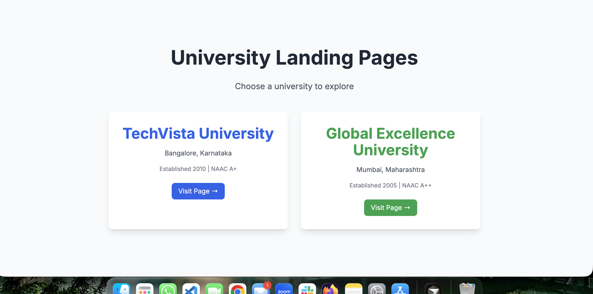
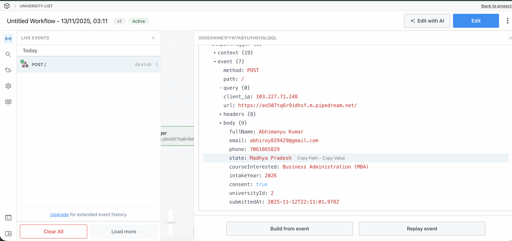

# 🎓 University Landing Pages

Two beautiful, responsive landing pages for private universities with integrated lead forms, APIs, and Pipedream workflow integration.

Built with Tailwind CSS and Express, this project includes mock APIs, lead-form handling, and an easy Pipedream integration for webhook testing.

## [Live Demo](https://university-list-taupe.vercel.app/)

<p align="center">
   <a href="https://university-list-taupe.vercel.app/" target="_blank" rel="noopener noreferrer">
   </a>
</p>


## 📸 Screenshots

### Home Page


### Pipedream Integration


---

## ✨ Features

- 🎨 **Two Complete Landing Pages** - TechVista University & Global Excellence University
- 📱 **Fully Responsive** - Works seamlessly on mobile and desktop
- 📝 **Lead Form** - Integrated with Pipedream for form submissions
- 🔌 **RESTful APIs** - Simple and nested JSON responses
- 💰 **Course Fees Modal** - Dynamic fee structure display
- ✅ **Form Validation** - Client-side validation with error handling
- 🎯 **Success/Error Messages** - No page refresh required
- 🚀 **Production Ready** - Optimized for deployment

---

## 🚀 Quick Start

### Prerequisites
- Node.js 18+ 
- npm or yarn

### Installation

1. **Clone the repository**
   ```bash
   git clone <your-repo-url>
   cd "University Landing Page"
   ```

2. **Install dependencies**
   ```bash
   npm install
   ```

3. **Set up environment variables**
   ```bash
   # Create .env file
   echo "PIPEDREAM_WEBHOOK_URL=your-pipedream-url-here" > .env
   ```

4. **Start the development server**
   ```bash
   npm start
   ```

5. **Visit the application**
   - Home: http://localhost:5001/
   - University 1: http://localhost:5001/university-1
   - University 2: http://localhost:5001/university-2

---

## 🛠️ Tech Stack

- **Frontend:** HTML, CSS, Tailwind CSS, JavaScript
- **Backend:** Node.js, Express.js
- **Integration:** Pipedream (Webhook)
- **Build Tool:** PostCSS, Tailwind CSS

---

## 📁 Project Structure

```
University Landing Page/
├── public/          # Frontend files (HTML, CSS, JS)
├── routes/          # API and page routes
├── controllers/     # Business logic
├── data/            # Mock data
├── config/          # Configuration
├── assets/          # Images and assets
└── docs/            # Documentation
```

---

## 🔧 Available Scripts

```bash
npm start      # Build CSS and start server
npm run dev    # Development mode with auto-reload
npm run build  # Build CSS only
```

---

## 📚 Documentation

Detailed documentation is available in the `docs/` folder:

- [Quick Start Guide](docs/QUICKSTART.md)
- [Pipedream Setup](docs/PIPEDREAM_SETUP.md)
- [Deployment Guide](docs/VERCEL_DEPLOYMENT.md)
- [Get Webhook URL](docs/GET_WEBHOOK_URL.md)

---

## 🚀 Deployment

This project can be deployed to:

- **Vercel** (Recommended) - [Deployment Guide](docs/VERCEL_DEPLOYMENT.md)
- **Render** - Free tier available
- **Railway** - Easy one-click deploy
- **Netlify** - With serverless functions

### Environment Variables

Set these in your hosting platform:

- `PIPEDREAM_WEBHOOK_URL` - Your Pipedream webhook URL (required)

---

## 📝 API Endpoints

### University Data
- `GET /api/university/:id/overview` - University overview
- `GET /api/university/:id/courses` - Courses with fees (nested JSON)
- `GET /api/university/:id/facilities` - Campus facilities
- `GET /api/university/:id/placements` - Placement statistics

### Form Submission
- `POST /api/submit-lead` - Submit lead form to Pipedream
- `GET /api/test-pipedream` - Test Pipedream connection

---

## 🎯 Form Fields

The lead form includes:
- Full Name
- Email
- Phone Number (10-digit, India)
- State
- Course Interested
- Intake Year
- Consent Checkbox

---

## 📄 License

ISC License

---

## 👤 Author

Your Name - [Your GitHub](https://github.com/yourusername)

---

## 🙏 Acknowledgments

- Tailwind CSS for styling
- Pipedream for workflow automation
- Express.js for the backend framework

---

**⭐ If you find this project helpful, please give it a star!**
